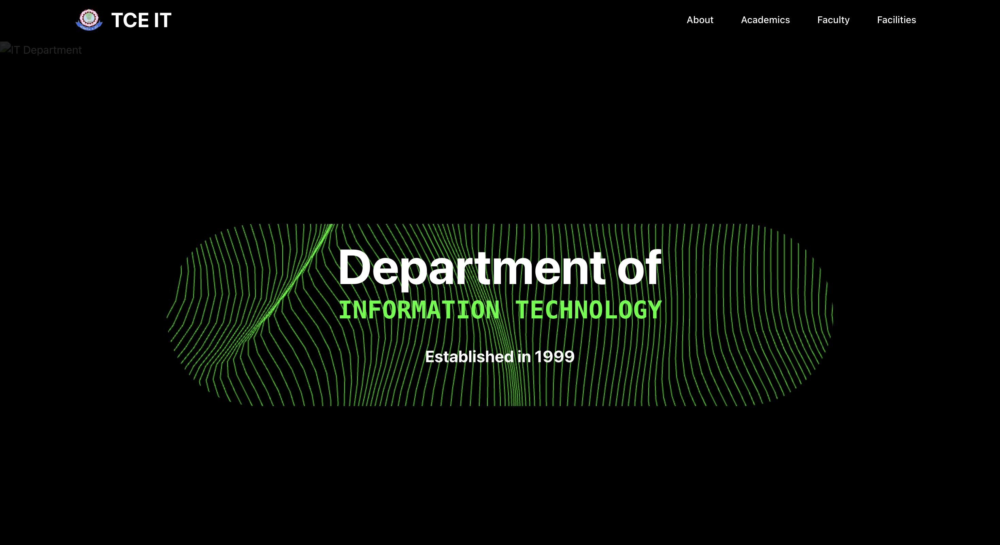
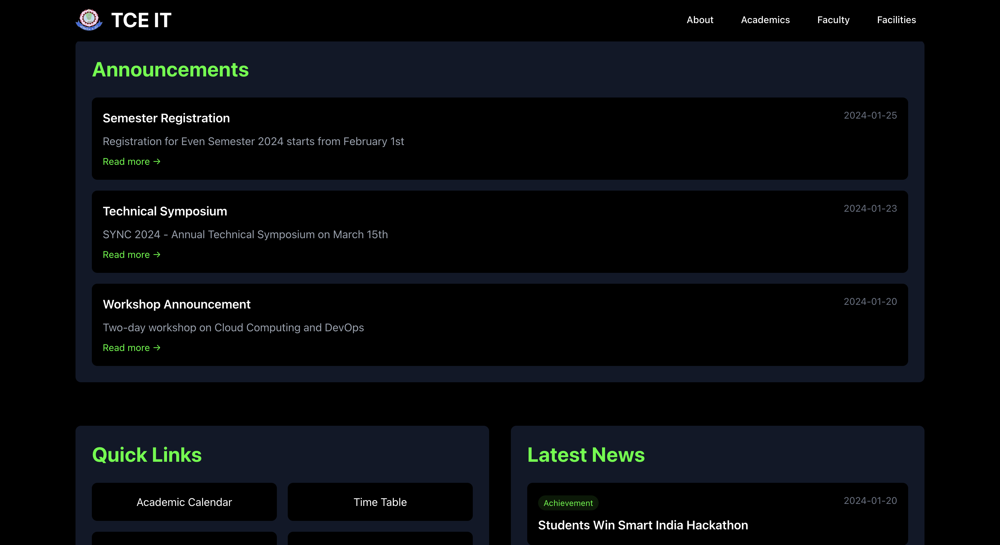
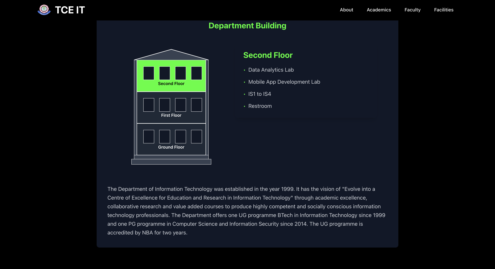
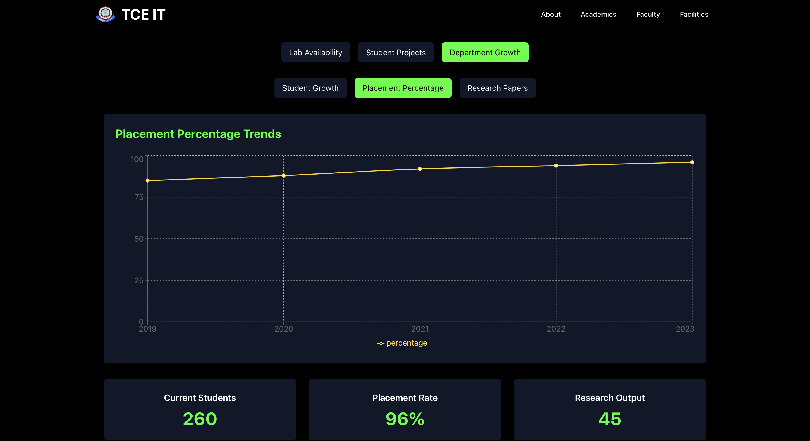

# IT Department Portal

A modern web application for managing and showcasing the Information Technology department's resources, activities, and information.

## Features

### Academic Management

- Course curriculum and syllabus management
- Faculty directory with profiles and research areas
- Academic calendar and timetable
- Student project showcase

### Facilities

- Lab management and scheduling
- Equipment tracking and maintenance history
- Project workspace allocation

### Information Hub

- Department announcements and news
- Latest events and activities
- Faculty publications
- Placement updates

### Student Resources

- Course materials access
- Lab availability checking system
- Academic resources

## Tech Stack

### Frontend

- React with Vite
- TailwindCSS for styling
- Framer Motion for animations
- Recharts for data visualization
- Axios for API communication

### Backend

- Node.js with Express
- MongoDB for database
- Mongoose for ODM
- PDF parsing capabilities
- Web scraping utilities

### Screenshots

